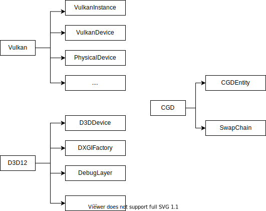

<!--
 * @Author: your name
 * @Date: 2020-03-04 07:52:14
 * @LastEditTime: 2020-03-06 11:28:25
 * @LastEditors: Please set LastEditors
 * @Description: In User Settings Edit
 * @FilePath: \docs\Modules\CGD\CGD.md
 -->
<h1 align="left">CGD模块</h1>

## 简介
&emsp;&emsp;CGD是SakuraEngine的跨图形接口抽象层, 即通用图形设备。CGD是兼容驱动各种现代图形API的一层薄抽象, 除了一些虚表调用外力求0 overhead。CGD力求兼容所有现代图形API的同时保证编程层面上的简化以及"原汁原味", 让用户能够像在原生的现代API下一样思考问题。

&emsp;&emsp;CGD的另一个特点是不引入状态, 这也是现代图形API的一个最大特点(所有的状态由用户维护)。

!> &emsp;&emsp;旧式的图形API倾向于把状态交由Driver管理, 例如在OpenGL中您可以使用int句柄和纯函数操作所有的绘图功能。

&emsp;&emsp;这同时意味着CGD可以作为一个静态库被链接到任何您需要的目标上, 并且不会引入全局的状态混乱。如果您对**状态**有疑问, 请参阅[Modules](/Modules/README.md)。


## CGD扼要

&emsp;&emsp;CGD API主要分为以下几部分:

- [设备族](StaticBuilds/CGD/CGD_Device.md)
- [命令族](StaticBuilds/CGD/CGD_Command.md)
- [资源族](StaticBuilds/CGD/CGD_Resource.md)

&emsp;&emsp;为了驱使CGD进行绘制, 您需要为CGD创建出一套上下文设备, 它们被称为[设备族](StaticBuilds/CGD/CGD_Device.md)。没有上下文, 图形API们就不能控制显卡进行绘制工作。和原生的图形API相比, CGD的初始化更为简单, 并使用结构**设备实体**进行包裹来辅助您的管理。下图可让您看出设备实体的映射关系以及简洁性。



!>&emsp;&emsp;此部分面向不熟知现代图形API流程的用户, 如果您对Vk或者D3D12这些现代图形API有一定了解, 可以直接通过下方的例程进行快速入门。

&emsp;&emsp;要将命令送往GPU, CPU需要预先完成一系列的指令录制工作, 我们把指令相关的一系列接口称为[指令接口/命令族]()。在CGD中, 指令的录制交给接口CommandContext完成, 而提交则交给接口CommandQueue完成, 您也可以申请多个CommandContext, 之后统一的提交给一条CommandQueue。

?>现代图形API都支持并推荐使用AsyncCompute, 这能让您把不同性质的GPU任务交给不同的队列来完成。</br> 
&emsp;**- GraphicsQueue**: 提交图形绘制任务, 仅能有一条;</br> 
&emsp;**- ComputeQueue**: 提交通用计算任务, 可以有多条;</br> 
&emsp;**- CopyQueue**: 提交拷贝任务, 可以有多条。

&emsp;&emsp;申请一个命令族对象需要传入一个有效的[**设备实体**](StaticBuilds/CGD/CGD_Device.md)。**设备实体**内含一组默认的命令队列, 您可以在初始化设备族后, 使用CGD::InitQueueSet来初始化它们。InitQueueSet会检查设备支持, 它总是会返回给您一组能够直接用于绘图的命令队列。

&emsp;&emsp;具体的渲染资源们(例如贴图, 以及绑定到shader的结构们)被称为[资源族](StaticBuilds/CGD/CGD_Device.md)。提供一个设备实体可以从CGD申请到它们, 但是需要您自行进行资源管理。

&emsp;&emsp;更加详细的内容, 请您在使用中探索, 或去往子目录查询更为详细的文档接口手册。

## 快速入门
### 创建设备, 队列集以及交换链
&emsp;&emsp;在绘图前, 我们也需要创建一系列[设备族](StaticBuilds/CGD/CGD_Device.md)。在CGD中, 一组必须的设备和一套异步计算的队列集被封装进一个结构**CGDEntity**中。您同样需要创建对应窗口的**SwapChain**。在下例中, CGD和SDL共同完成了设备的初始化以及窗口的创建。

``` cpp
    Sakura::Graphics::Vk::CGDEntityVk entityVk;
    VkSurfaceKHR surface;
    SDL_Window* win = nullptr;
    
    using Sakura::Graphics::Vk::CGD_Vk;
    Sakura::Graphics::CGDInfo cgd_info;
    cgd_info.enableDebugLayer = true;
    cgd_info.extentionNames = VkSDL_GetInstanceExtensions(win,
        cgd_info.enableDebugLayer);
    using CGD = CGD_Vk;
    CGD::Initialize(cgd_info, entityVk);
    SDL_Vulkan_CreateSurface(win, entityVk.GetVkInstance(), &surface);
    CGD::InitQueueSet(&surface, entityVk);
    CGD::CreateSwapChain(width, height, entityVk, &surface);
```
